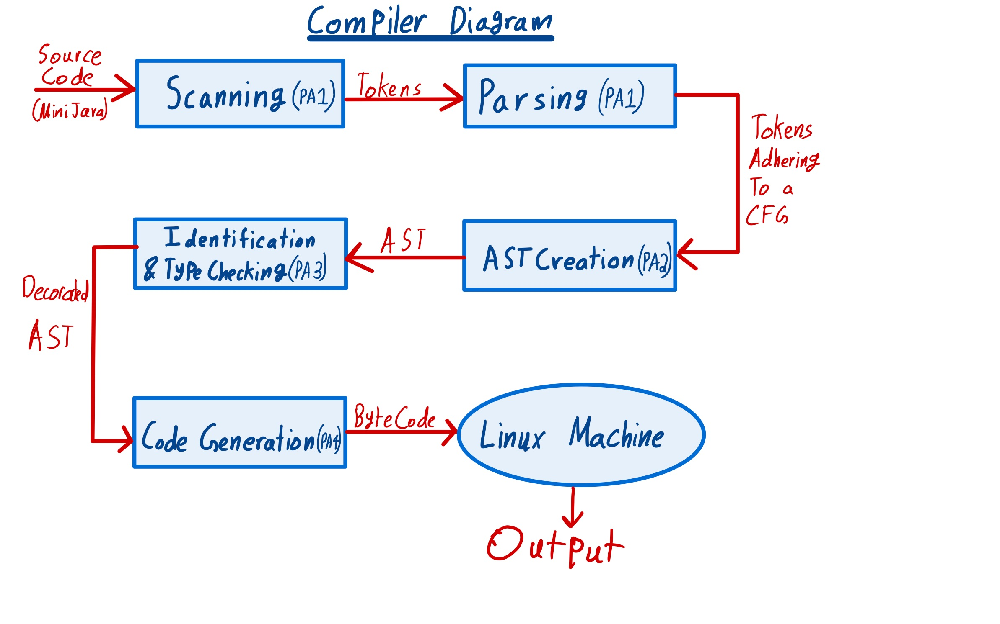

# COMP520 Programming Assignment

This is a Compiler for the MiniJava language meant to take code written in 
miniJava and compile it into byte code that targets x86/64 processors and
the Linux operating system

The diagram below depicts the process of how this Compiler works:

## Documentation of My Progress:

### PA1:
Syntactic analysis and Parser for a Context Free Grammar of MiniJava

### PA2:
AST generation and traversal

### PA3:
Contextual analysis: Identification of variable declaration and type checking

### PA4:
Code generation

### PA5:
Documentation
